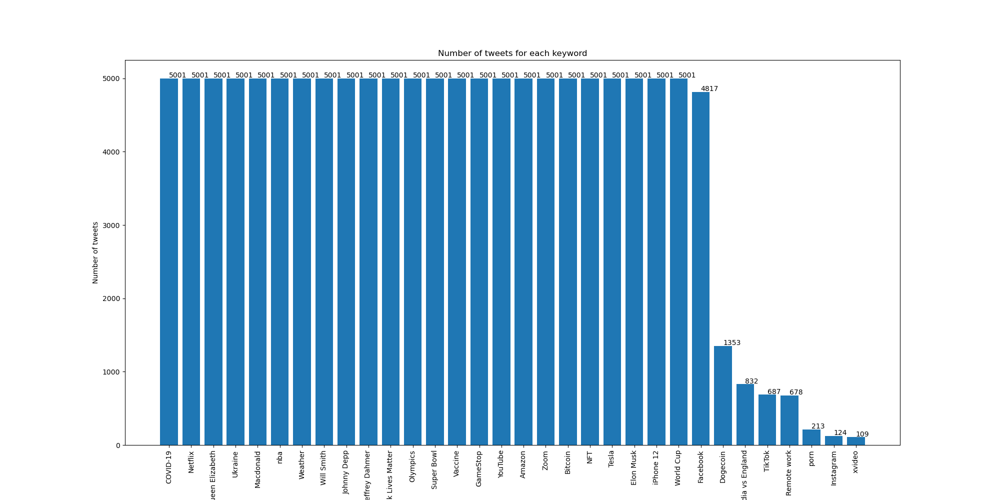

# Twitter-Crawler

Crawling Twitter's reply and save their contents and likes

## Dataset

|Name|type|Description|
|:---:|:---:|:---:|
|keyword|`str`|Keyword of the tweet|
|likes|`int`|Number of likes|
|tweet|`str`|Content of the tweet|

## Usage

Top 20 keywords in 2021, each keyword has `5000` tweets
```

"COVID-19",
"Vaccine",
"Zoom",
"Bitcoin",
"Dogecoin",
"NFT",
"Elon Musk",
"Tesla",
"Amazon",
"iPhone 12",
"Remote work",
"TikTok",
"Instagram",
"Facebook",
"YouTube",
"Netflix",
"GameStop",
"Super Bowl",
"Olympics",
"Black Lives Matter"
```



## Method

Using [Snscrape](https://github.com/JustAnotherArchivist/snscrape)

Install Snscrape

`pip3 install snscrape`

Development version

`pip3 install git+https://github.com/JustAnotherArchivist/snscrape.git`

## Reference

- [Web Scraping with Python – How to Scrape Data from Twitter using Tweepy and Snscrape](https://www.freecodecamp.org/news/python-web-scraping-tutorial/)
- [Tweepy](https://github.com/tweepy/tweepy)
- [Snscrape](https://github.com/JustAnotherArchivist/snscrape)
- [Twitter Developer](https://developer.twitter.com/en)
